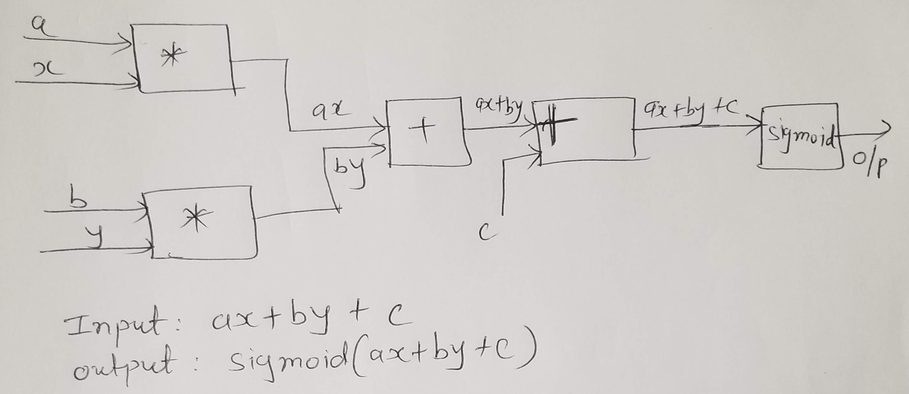

In this repository, I'm implementing back-propagation from scratch using technique described in 
http://karpathy.github.io/neuralnets/

Let's try to implement following:

- i/p: ax + by +c
- o/p: sigmoid(ax+by+c)

